<div align="center">

# PlayHack

### Campus sports facility booking for IIT Guwahati

**Fifty students tap “Book” on the same court at 6:00 PM.
Exactly one gets it — and that decision is made by Postgres, not by our code.**

[**▶ Live demo**](https://innovait-hackathon.vercel.app) · [Run the race yourself](https://innovait-hackathon.vercel.app/race) · [Architecture](docs/ARCHITECTURE.md) · [Deploying](docs/DEPLOY.md)

[](https://github.com/dipuda007/playhack-innovait/actions/workflows/ci.yml)


<br>

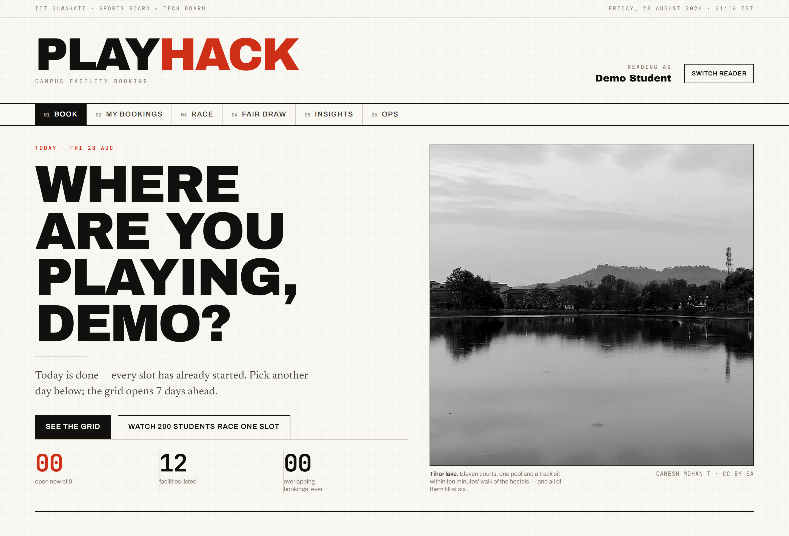

</div>

---

## The problem, stated exactly

> At 6:00 PM, many students request the same facility and time slot at once. The
> system must confirm **exactly one** and reject the rest, without corrupting
> data.
>
> — PlayHack SDE Track brief

Almost every booking system answers this the same way, and almost every one of
them is wrong:

```ts
const taken = await isSlotTaken(court, slot);   // ← the question
if (!taken) await insertBooking(court, slot);   // ← the answer
```

Both lines are individually reasonable. Between them is a gap, and under load
another request commits inside it. Two students walk to the same court.

## The answer, in one statement

```sql
ALTER TABLE bookings ADD CONSTRAINT bookings_no_overlap
  EXCLUDE USING gist (facility_id WITH =, during WITH &&)
  WHERE (status = 'confirmed');
```

There is no question and no answer — **the write *is* the decision.** A booking
carries a time range, and the database physically cannot store two overlapping
ranges for the same facility. The loser is rejected with SQLSTATE `23P01`
before it ever becomes a row.

Three things follow from that, and they are why this beats a `UNIQUE` key:

| | `UNIQUE (facility_id, starts_at)` | `EXCLUDE … WITH &&` |
|---|---|---|
| Two bookings at 18:00 | rejected | rejected |
| 18:00–19:00 vs **18:30–19:30** | **both stored** | rejected |
| Two-hour maintenance block over four slots | not expressible | one row |
| Cancelling frees the slot | needs a delete | status flip, free |

Partial overlap is the case that actually happens, and it is the case a unique
index cannot see.

---

## Watch it happen

The same burst, fired twice: once at a textbook check-then-write, once at the
constrained path. Nothing is simulated — both write to real Postgres tables
through a real HTTP endpoint.

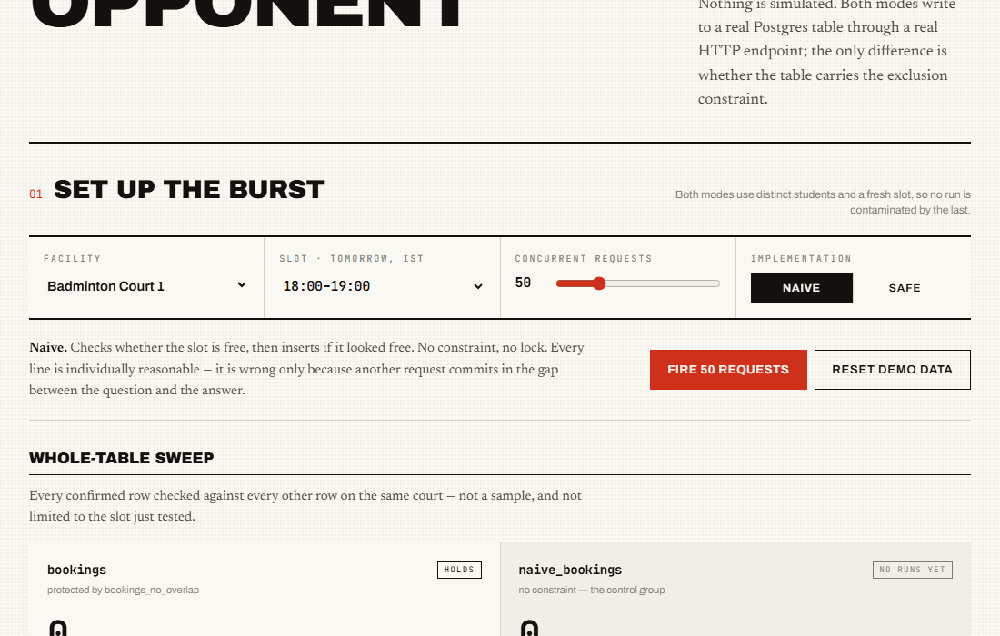

<table>
<tr>
<td width="50%">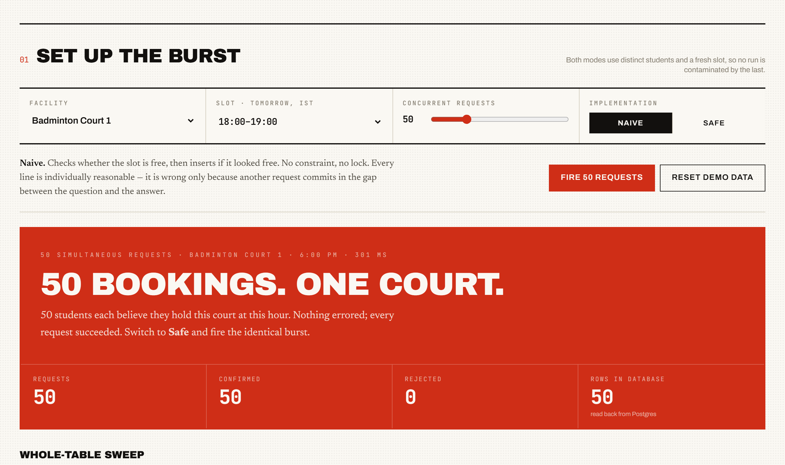</td>
<td width="50%">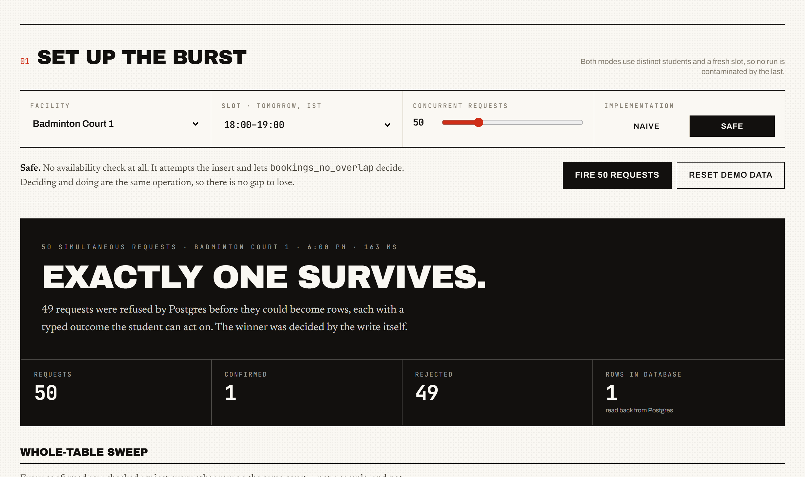</td>
</tr>
<tr>
<td align="center"><b>Naive.</b> Every request succeeded. Nothing errored.<br>Fifty students hold the same court.</td>
<td align="center"><b>Constrained.</b> One row. 199 typed rejections,<br>each carrying alternatives the student can act on.</td>
</tr>
</table>

### Measured on the deployed app

Vercel functions in `sin1`, Neon Postgres in `ap-southeast-1`, one clean run of
each straight after a reset:

| Mode | Requests | Server time | Confirmed | Rows in DB | Overlapping pairs |
|---|---:|---:|---:|---:|---:|
| naive | 50 | 305 ms | 50 | 50 | **1 225** |
| safe | 10 | 56 ms | 1 | 1 | 0 |
| safe | 50 | 144 ms | 1 | 1 | 0 |
| safe | 100 | 320 ms | 1 | 1 | 0 |
| safe | **200** | **652 ms** | **1** | **1** | **0** |

Flat, not linear, because nothing in the write path serialises on *n*: all
contenders attempt the insert at once, one wins, the rest block on its
uncommitted row and are released together the moment it commits.

The overlapping-pair count is not a check of the slot just tested — it is a
whole-table sweep, every confirmed row against every other row on the same
court, run after every single race.

---

## Beyond “it does not double-book”

Correctness is the floor. Five things are built on top of it, each solving a
problem the constraint alone does not.

| | What it does | Why it is not obvious |
|---|---|---|
| **Idempotency keys** | A retried submit returns the original booking | Transactions cannot tell a retry from a second intent — both are valid requests. A double-tap on a flaky hostel connection is the common case, not the edge case |
| **Typed rejections** | Losing returns `SLOT_TAKEN`, `QUOTA_EXCEEDED`, `OVERLAPS_OWN`… with three alternative slots | An error page tells a student nothing. A reason plus a next action is a product |
| **Waitlist promotion** | Cancelling releases the slot *and* offers it to the next student in the **same transaction** | A background job leaves a window where the slot is free but unowned — precisely when a race would take it |
| **Maintenance closures** | A closure is a `bookings` row with `kind='block'` | One invariant, two features. A manager cannot close a court out from under a student's confirmed booking, because the same constraint refuses it |
| **Fair draw** | Peak slots go to a seeded, weighted, published lottery | Winning a race is not deserving the court. First-come-first-served rewards the best wifi. The seed is printed with the result so anyone can recompute the winner |

---

## How a booking is decided

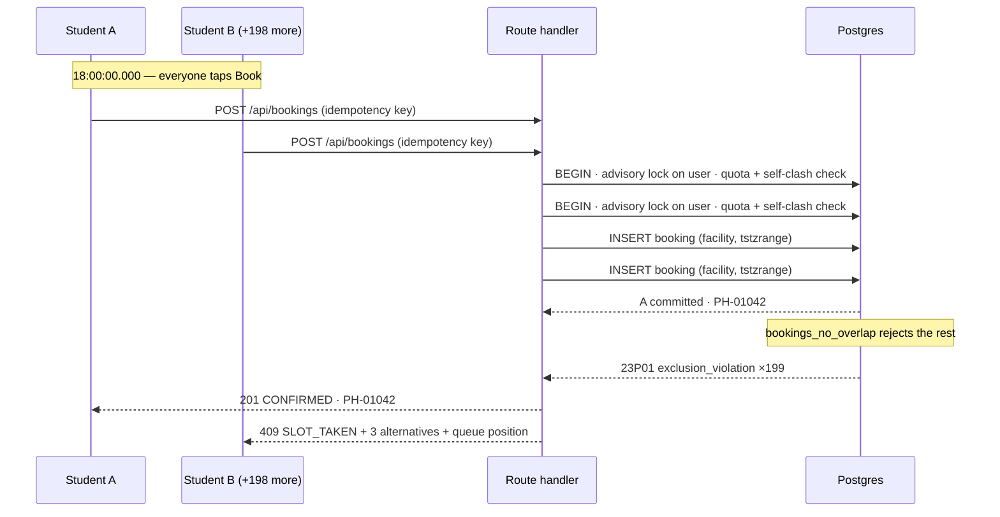

No availability check on the write path. No application-level lock on the slot.
The only lock taken is per **user**, because the quota check is a genuine
read-then-write and one student firing ten parallel requests would otherwise
pass ten quota checks.

### Availability is derived, never stored

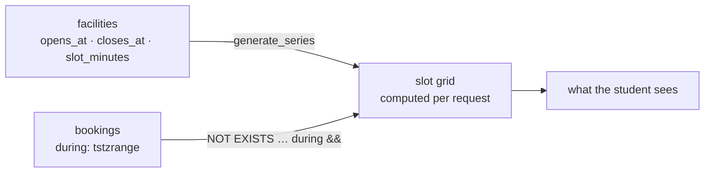

There is no `slots` table. A row per court per hour per day would be a *second*
source of truth about occupancy, and the moment it disagrees with `bookings`
the brief's consistency requirement is already lost.

---

## The interface

Set as a broadsheet: ink on paper, one vermilion accent, hairline rules, and a
serif for anything that argues a case. No gradients, no glass, no glow, no
shadows — hierarchy comes from rule weight, type size and empty space, the way
print has always done it.

Slot state is carried by **fill, not hue** — open is paper, taken is solid ink,
yours is vermilion, closed is hatched — so the grid stays readable in
greyscale, to a colourblind reader, and through a badly calibrated projector.

<table>
<tr>
<td width="50%">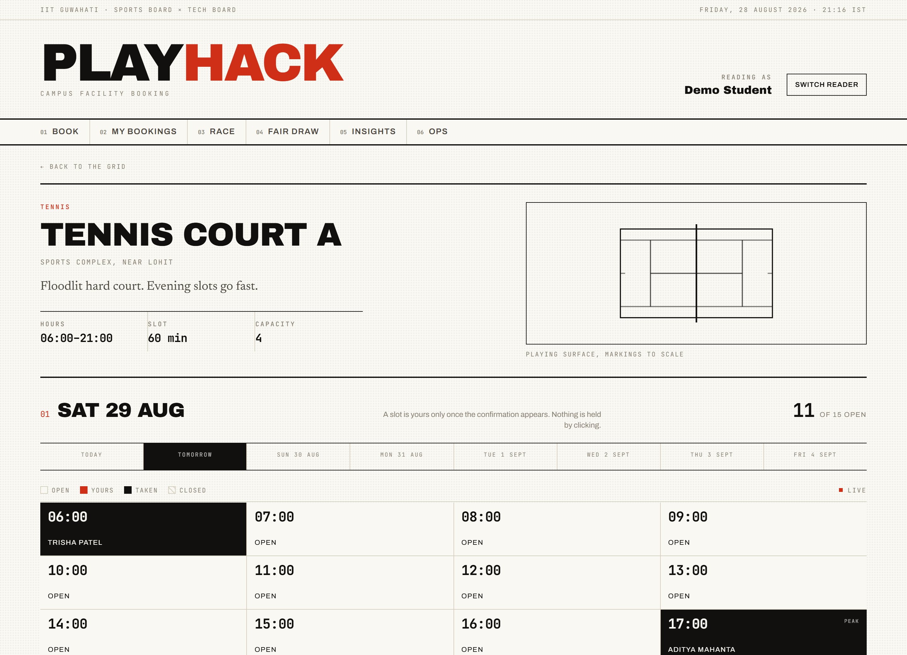<br><sub><b>Booking.</b> The day as a fixture table, live over SSE.</sub></td>
<td width="50%">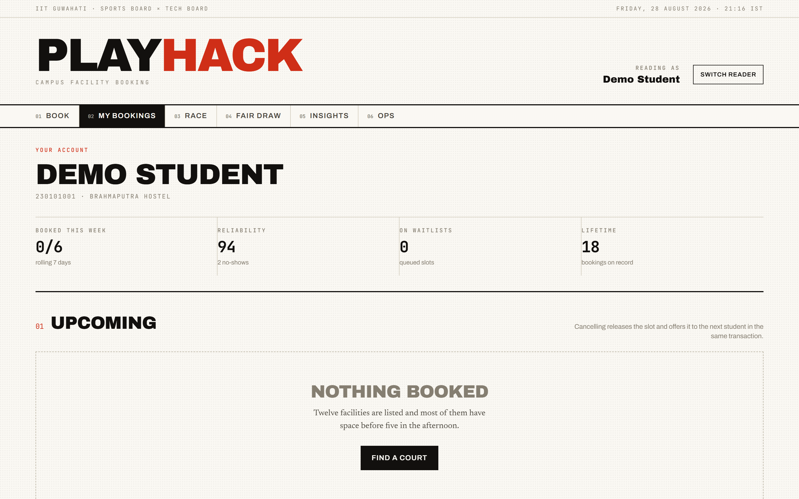<br><sub><b>My bookings.</b> Standing, upcoming, and every booking on record.</sub></td>
</tr>
<tr>
<td width="50%">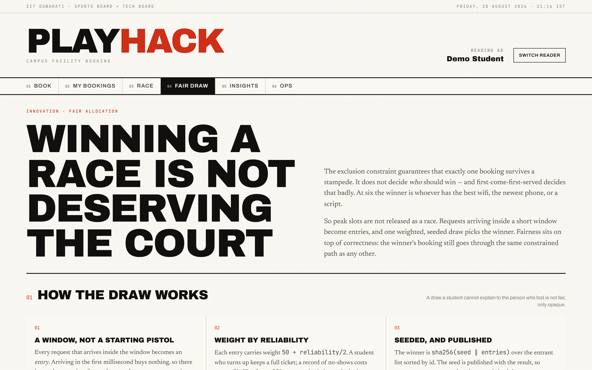<br><sub><b>Fair draw.</b> Rules and seed published before the draw.</sub></td>
<td width="50%">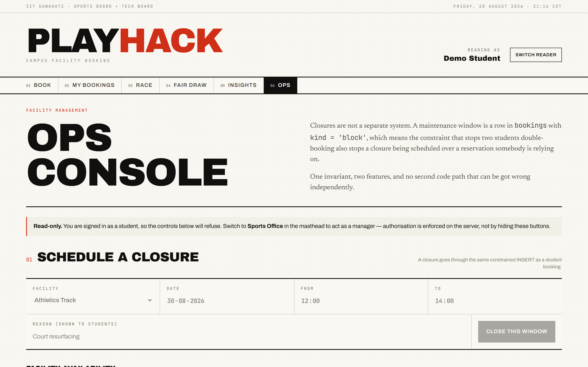<br><sub><b>Ops.</b> Closures refused by the same constraint.</sub></td>
</tr>
<tr>
<td width="50%">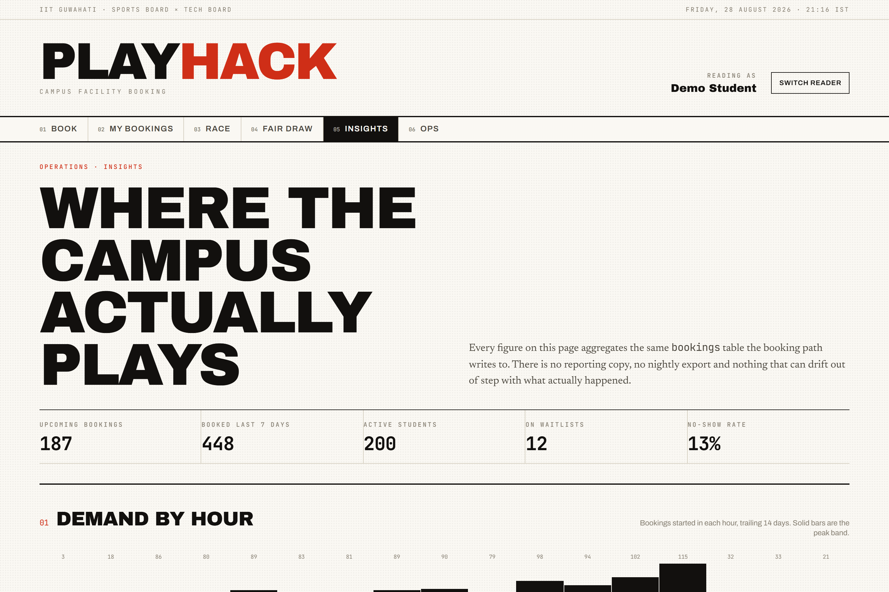<br><sub><b>Insights.</b> Aggregated from the booking table itself.</sub></td>
<td width="50%" align="center">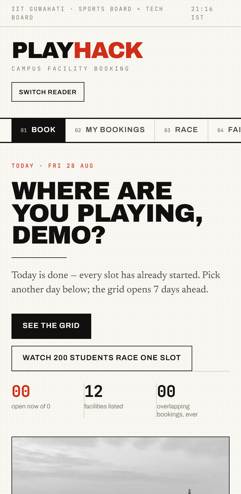<br><sub><b>Mobile.</b> Students book from phones, so this is not an afterthought.</sub></td>
</tr>
</table>

---

## Run it

**Requirements:** Node 20+, and a Postgres 17 with `btree_gist` available
(local, Neon, Supabase — all fine).

```bash
git clone https://github.com/dipuda007/playhack-innovait
cd playhack-innovait
npm install

cp .env.example .env          # then set DATABASE_URL and SESSION_SECRET
npm run db:reset              # migrate + seed 201 students and 12 facilities
npm run dev                   # http://localhost:3000
```

`db:push` refuses to finish unless `bookings_no_overlap` exists afterwards, so
a silently unconstrained database is not a state you can reach.

### Prove it rather than trust it

```bash
npm test              # 19 unit tests — the concurrency suite included
npm run invariant     # whole-table sweep, exits non-zero on any violation
npx tsx scripts/e2e.mts   # 11 browser checks: book → confirm → cancel → reopen
```

What the concurrency suite actually asserts:

- 50 simultaneous identical attempts → exactly 1 booking, 49 × `23P01`
- staggered **partially overlapping** attempts → exactly 1 survives
- six adjacent slots → all six succeed (half-open bounds are not overlaps)
- five different courts at the same instant → all five succeed
- 40 concurrent product-level bookings → 1 confirmed, 39 typed rejections
- a replayed idempotency key → at most one row, ever
- cancel → the next request wins the freed slot
- 200 concurrent attempts across 10 slots → exactly 10 bookings
- **whole-table sweep: zero overlapping confirmed pairs across every row**
- the naive implementation, for contrast → double-books on demand

---

## Repository map

```
migrations/0001_init.sql   the schema — and the constraint that is the product
src/db/client.ts           pool, SQLSTATE constants, deadlock retry
src/lib/booking.ts         the write path: create, cancel, promote, suggest
src/lib/race.ts            the race harness and the whole-table invariant sweep
src/lib/lottery.ts         seeded weighted draw, deterministic and auditable
src/lib/availability.ts    derived availability — no slots table
src/app/                   Next.js App Router: pages and route handlers
src/components/            broadsheet UI, court diagrams, sport glyphs
tests/                     vitest — concurrency and lottery suites
scripts/                   migrate · seed · invariant · e2e · media capture
docs/ARCHITECTURE.md       data model, trade-offs, what we would do next
docs/DEPLOY.md             Neon + Vercel, and the region that matters
```

---

## Credits

Built by **Team InnovAIT** for PlayHack, IIT Guwahati Sports Board × Tech Board.

Campus photography from Wikimedia Commons — Tihor lake by Ganesh Mohan T
(CC BY-SA 4.0), academic complex by Satyadeep Karnati (public domain). Full
details in [`public/campus/CREDITS.md`](public/campus/CREDITS.md).

Code is MIT licensed. See [LICENSE](LICENSE).
