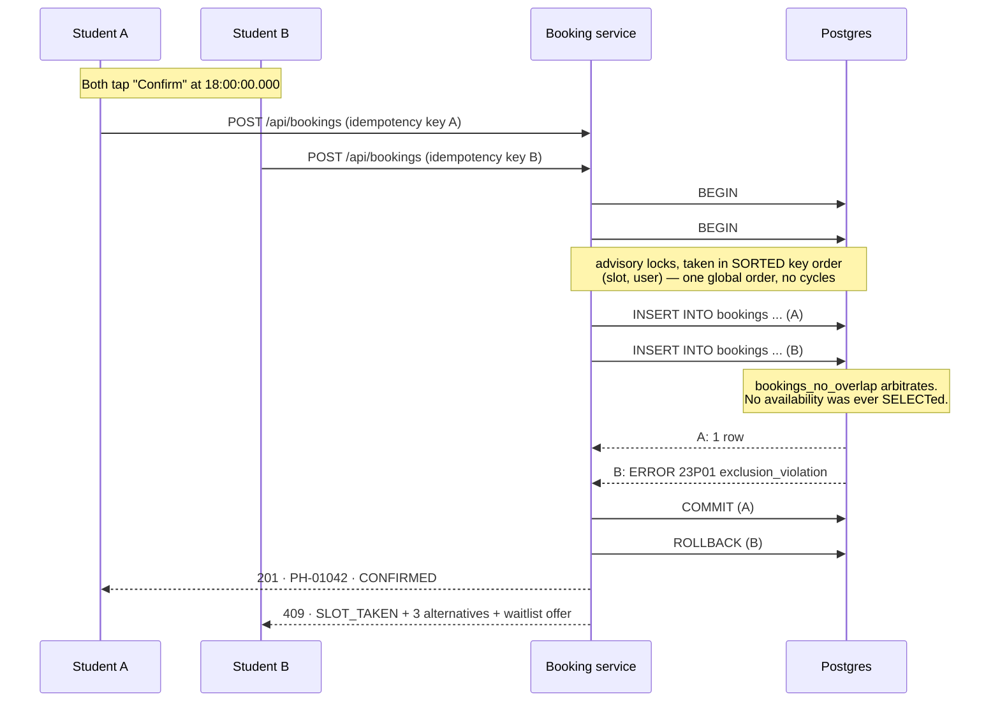
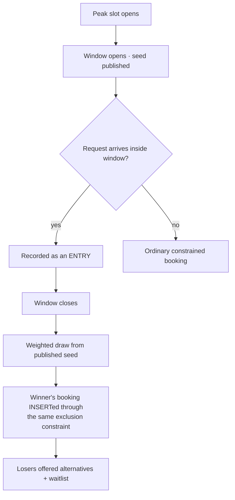

# Architecture

Team InnovAIT · PlayHack SDE Track

---

## 1. The one-line thesis

Correctness of a booking system is a property of the **data model**, not of the
application code. Put the invariant where no code path can route around it, and
concurrency stops being a thing you have to be careful about.

---

## 2. Data model

```
users ──┬──< bookings >──── facilities
        │        │
        │        └──< booking_events        (audit + outbox)
        ├──< waitlist >──── facilities
        └──< lottery_entries >── lotteries >── facilities
```

### The decisive table

```sql
CREATE TABLE bookings (
  id               uuid PRIMARY KEY DEFAULT gen_random_uuid(),
  facility_id      uuid NOT NULL REFERENCES facilities(id),
  user_id          uuid REFERENCES users(id),          -- NULL for closures
  kind             booking_kind NOT NULL DEFAULT 'booking',   -- booking | block
  status           booking_status NOT NULL DEFAULT 'confirmed',
  during           tstzrange NOT NULL,                 -- ONE value, not two
  idempotency_key  text NOT NULL UNIQUE,
  booking_code     text NOT NULL UNIQUE
                   DEFAULT ('PH-' || lpad(nextval('booking_code_seq')::text, 5, '0')),
  ...
);

ALTER TABLE bookings ADD CONSTRAINT bookings_no_overlap
  EXCLUDE USING gist (facility_id WITH =, during WITH &&)
  WHERE (status = 'confirmed');
```

Three decisions worth defending:

**`during` is a range, not `starts_at` + `ends_at`.** Overlap is a first-class
operation on a range (`&&`) and GiST can index it. With two loose columns the
overlap test is application logic, which is exactly where it must not live.

**Half-open `[)` bounds.** 18:00–19:00 and 19:00–20:00 are adjacent, not
overlapping, so back-to-back bookings stay legal. Closed bounds would reject
every consecutive pair.

**The partial predicate `WHERE status = 'confirmed'`.** Cancellation is a status
flip: the row leaves the index and the slot frees instantly. No deletes, no
tombstones, complete history.

**`booking_code` comes from a sequence, not from random characters.** Four
base-32 characters is ~1M values, and the birthday bound puts collisions in the
low thousands of rows — surfacing as a unique-violation 500 on a valid booking.
This was found by load testing, not by reasoning. Sequences are gap-tolerant and
collision-free; gaps are harmless, duplicates are not.

---

## 3. The write path



The critical property: **there is no window between deciding and doing, because
they are the same statement.**

### Rejection is a typed outcome

`SLOT_TAKEN` · `OVERLAPS_EXISTING` · `OVERLAPS_OWN` · `QUOTA_EXCEEDED` ·
`FACILITY_CLOSED` · `UNDER_MAINTENANCE` · `PAST_SLOT` · `BEYOND_HORIZON` ·
`MISALIGNED_SLOT` · `IDEMPOTENT_REPLAY` · `LOTTERY_LOST`

Under a 200-way race, 199 of these fire at once. If any surfaced as an unhandled
exception the demo would look like a crash rather than a correctly enforced
invariant. Every rejection also carries up to three alternative slots, so losing
a race is never a dead end.

---

## 4. Concurrency control, by problem

Different problems get different mechanisms, each at the cheapest level that is
actually correct.

| Problem | Mechanism | Why not something else |
|---|---|---|
| Two students, one slot | `EXCLUDE` constraint | No lock needed; the constraint already decides it, in the storage engine |
| One student, ten parallel taps (quota) | per-user advisory lock | Quota is a genuine read-then-write; different users never contend |
| Thundering herd on one slot | *nothing* — let them all hit the constraint | One winner commits, the rest are released together with `23P01`; a queue-forming lock would serialise them across the network instead |
| Retry vs. second intent | unique idempotency key | Transactions cannot tell these apart — both are valid requests |
| Cancellation → promotion | same transaction + partial unique index | A separate job leaves a window where the slot is free but unowned |
| Concurrent promoters | `FOR UPDATE SKIP LOCKED` | Promoters take different rows instead of blocking |
| Who *deserves* a peak slot | seeded weighted draw | Correctness ≠ fairness; FCFS rewards the best wifi |

### Why there is no per-slot lock

There used to be one, taken alongside the per-user lock in sorted key order.
Against a database on the same machine it was faster: contenders queued on a
cheap lock instead of piling into the constraint's wait-for-uncommitted-row
path, and sorting the keys made a deadlock cycle impossible to construct.

Deployed, it inverted. The lock serialises every contender, so each one pays a
full network round trip in turn. Measured in production with functions in
`iad1` (Washington DC) and Neon in Singapore — about 250 ms per round trip:

| n | wall clock |
|---|---|
| 2 | 6.3 s |
| 5 | 10.6 s |
| 10 | 19.2 s |
| 20 | 36.4 s |
| 50 | function timeout |

Linear at ~1.8 s per contender. Note what did *not* break: every one of those
runs confirmed exactly one booking, with zero overlapping pairs. The constraint
was never the problem. The lock in front of it was.

Two changes, and the round trips behind them:

1. **Drop the slot lock.** All contenders now attempt the insert
   simultaneously. One wins; the others block on its uncommitted row and are
   released the moment it commits, each receiving `23P01`. Cost is one
   transaction plus one round trip, independent of *n*. The same commit folded
   the quota and self-clash checks into a single query and the insert plus
   audit-event write into a second, taking the request from seven round trips
   to three.
2. **`vercel.json` → `"regions": ["sin1"]`.** Co-locating the functions with
   the database turns each of those round trips from ~250 ms into ~1 ms. A
   response now shows `x-vercel-id: bom1::sin1::…` — Mumbai edge, Singapore
   compute.

Same production deployment, after both:

| n | wall clock | confirmed | overlapping pairs |
|---|---|---|---|
| 10 | 702 ms | 1 | 0 |
| 20 | 350 ms | 1 | 0 |
| 50 | 555 ms | 1 | 0 |
| 100 | 529 ms | 1 | 0 |
| 200 | **1,244 ms** | 1 | 0 |

Flat rather than linear, because nothing in the write path serialises on *n*
any more.

The deadlock the sorted ordering used to prevent is gone with it: a cycle needs
two locks acquired in varying order, and each transaction now takes one.
`withDeadlockRetry` stays for the residual case — *partially* overlapping
ranges can still deadlock inside the constraint itself, and a deadlock victim
rolls back cleanly, so retrying it is always safe. Exclusion violations are
never retried; that is a settled result.

---

## 5. Availability is derived

There is no `slots` table. A row per court per hour per day would be a *second*
source of truth about occupancy, and the moment it can disagree with `bookings`
the consistency requirement is already lost.

Instead the grid is generated on the fly and left-joined against live bookings:

```sql
generate_series(open, close, slot_interval)  -- the grid
  WHERE NOT EXISTS (
    SELECT 1 FROM bookings b
    WHERE b.facility_id = ...
      AND b.status = 'confirmed'
      AND b.during && tstzrange(slot_start, slot_end, '[)')
  )
```

The read answers the same question the write path enforces, using the same
operator. They cannot diverge.

One query serves all facilities on the browse page — the grid does not degrade
into N+1 as the campus adds courts.

---

## 6. Live updates


The event payload is only a hint — *"something changed on this facility"*.
Clients respond by re-reading the day view rather than patching local state from
the message. A dropped, duplicated or out-of-order event therefore costs one
extra fetch and can never leave a screen disagreeing with the database. A slower
poll runs alongside as a fallback.

In-process fan-out is correct for a single instance. The multi-instance path is
Postgres `LISTEN`/`NOTIFY` behind the same `publish` / `subscribe` functions —
no call site changes.

---

## 7. Fair allocation



The seed is generated and stored when the window **opens**, before anybody has
entered, and weights come from stored reliability scores. Anyone can recompute
the draw from the recorded inputs and check they get the same winner — the draw
cannot be quietly re-rolled.

The draw itself is concurrent code and gets the same treatment as the rest of
the write path: the lottery row is locked `FOR UPDATE` and the draw plus the
winner's booking commit in one transaction, so two concurrent calls cannot both
award the slot.

---

## 8. Scaling

**Already true**

- Contention is sharded by `facility_id` — two courts never block each other,
  asserted by a test rather than assumed.
- The app tier is stateless; correctness lives in the database, so horizontal
  scaling needs no coordination.
- Availability has no second source of truth to keep in sync.
- 200 concurrent requests at one slot resolve in ~1.2 s in production, and
  ~350 ms against a local Postgres — flat in *n*, not linear.

**Next, in order**

1. PgBouncer / Neon pooler in transaction mode.
2. Cached materialised day-view with tag revalidation on booking events —
   availability reads dominate by volume and tolerate ~1 s staleness.
3. Monthly partitioning of `bookings`, GiST index per partition. Exclusion
   constraints work per-partition, which suits a workload where nobody queries
   across months.
4. Read replicas for the browse and analytics paths; writes stay on the primary
   because that is where the constraint is.

---

## 9. Trade-offs we would defend

| Decision | Cost | Why it is right here |
|---|---|---|
| Postgres-only | No Mongo/Firebase option | The invariant is the product; no other store expresses it |
| Constraint over app-level locking | Ties us to the DB | The DB is the only place no code path can bypass |
| Derived availability | Recomputed per request | One source of truth beats a fast lie |
| One advisory lock, on the user only | Contenders wait inside the constraint, not on a lock | Removing the per-slot lock took a 200-way burst from a function timeout to 1.2 s, and removed the only deadlock cycle we could construct |
| Functions pinned to `sin1` | Slower for a hypothetical US user | Every request is database-bound; ~250 ms per round trip dominated everything else |
| Signed-cookie identity | Not a credential system | The brief judges booking correctness, not auth; swap point is one function |
| In-process event fan-out | Single instance only | Correct now, documented path out, cannot cause a wrong booking |
| Sequence-based booking codes | Gaps in numbering | Gaps are harmless; duplicate codes are a 500 on a valid booking |
